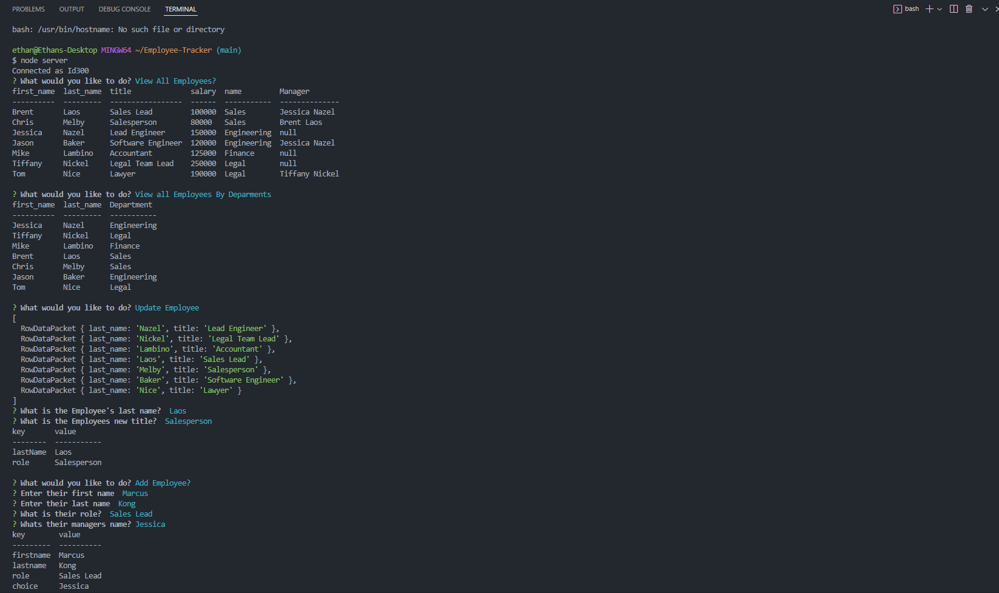

# Employee Tracker
  
  
  ## Description 
  A node.js application that uses user input from inquirer to populate an employee tracker database displaying members of a company.
  Click [here](https://drive.google.com/file/d/16JuRUscpIeihnacNgRlGtb7q5j_ZKkkf/view) to watch a walkthrough.

  

  ## Table of Contents
  * [Installation](#installation)
  * [Usage](#usage)
  * [License](#license)
  * [Contributing](#contributing)
  * [Tests](#tests)
  * [Questions](#questions)
  
  ## Installation 
  Clone repository from Github. Make sure to have the MySQL workbench installed so you may run the Schema.
  ## Usage 
  In order to use this application you will need to first run 'npm i' in your terminal to install the dependencies once you have cloned this repo. Once done you will need to run 'node server.js' in your terminal to start the prompts. You will be walked through the various tasks you can preform within the application.
  ## License 
  This project is license under MIT
  ## Contributing 
  Ethan Plott
  ## Tests
  no test have been done.
  ## Questions
  If you have any questions about this projects, please contact me directly at ethan.plott@yahoo.com. You can view more of my projects at https://github.com/EthanP94.
